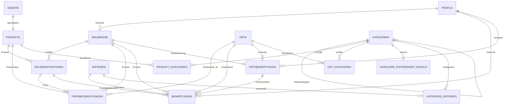
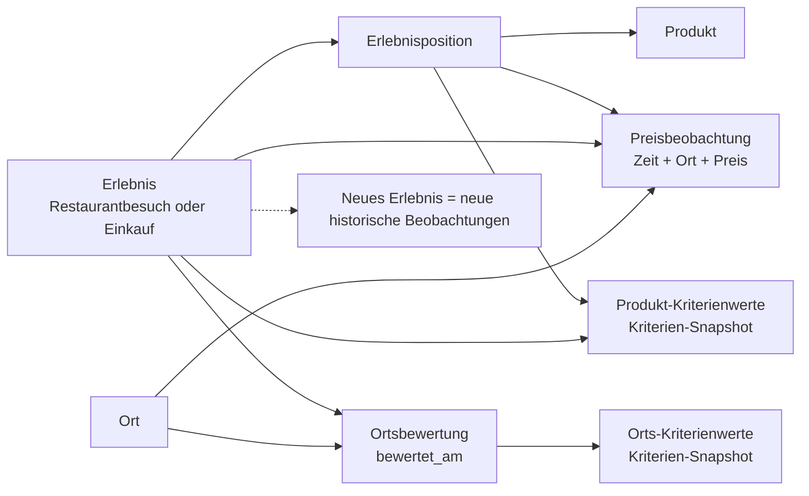

# Datenbank, Schema und Migrationen

## Ziel und Geltungsbereich

Taugt’s? speichert seine fachlichen Daten offline-first in einer lokalen SQLite-Datei `taugts.sqlite` im Application-Support-Verzeichnis der jeweiligen Plattform. Die Datenbank ist Arbeitsdatenbank; das versionierte JSON-Format ist das davon unabhängige Austausch- und Sicherungsformat.

Diese Seite beschreibt den aktuellen physischen Schema-Stand, seine Beziehungen, die historische Migrationskette und den Abgleich mit den fachlichen Stories. Maßgeblich für die Kernmigrationen ist `LokaleDatenbank`, für die zum aktuellen Stand zusätzlich erforderlichen Feature-Tabellen `AktuellesDatenbankschema`.

## Initialisierung und Schemastand

`LokaleDatenbank.oeffnen()` aktiviert `PRAGMA foreign_keys = ON`, liest `PRAGMA user_version` und führt notwendige Vorwärtsmigrationen innerhalb einer `BEGIN IMMEDIATE`-Transaktion aus. Eine neue Datenbank mit `user_version = 0` wird **direkt aus dem aktuellen Kernschema** erzeugt; sie durchläuft nicht künstlich die historischen Migrationen.

Die Produktions-Factory ergänzt anschließend deterministisch alle aktuellen Feature-Tabellen. Historisch wurden Kategorien, Klassifikation, Kategorie-Kriteriensets und Import-Hilfstabellen erst beim ersten Zugriff auf ihr jeweiliges Repository erzeugt. Diese DDL-Aufrufe bleiben vorerst idempotent bestehen, sind aber nicht mehr Voraussetzung dafür, dass eine über die Produktions-Factory geöffnete Datenbank vollständig strukturiert ist.

Die historische Upgrade-Kette wird bewusst nicht gelöscht: Eine bereits installierte App kann noch eine ältere `user_version` besitzen. Ein echtes „Squashen“ der Migrationen würde diese Nutzerdaten von einem Updatepfad abschneiden.

## Migrationshistorie

| Zielstand | Inhalt der Migration |
| --- | --- |
| V2 | Änderungszeitpunkt bestehender Bewertungen ergänzt. |
| V3 | Lokales Profil und Herkunftsreferenzen für Erlebnisse/Bewertungen eingeführt. |
| V4 | Produktstammdaten um Produktart, Brauerei, Sorte, Alkohol, Herkunft, Gebinde, Füllmenge, Barcode und Notiz erweitert. |
| V5 | Orte um Adresse, Koordinaten, OSM-Referenz und Notiz erweitert. |
| V6 | Frühes Erlebnisformat um Preis, Menge, Gebinde, Notiz und Entwurfsstatus erweitert. |
| V7 | Bewertungskriterien um Beschreibung, Eingabetyp, Reihenfolge und Aktivstatus erweitert. |
| V8 | Erlebnis auf Typ, Status, Planung sowie tatsächlichen Beginn/Ende umgestellt; Altwerte wurden übernommen. |
| V9 | Erlebnispositionen und historische Preisbeobachtungen eingeführt; frühere Einzelprodukt-/Preisfelder wurden in die neue Struktur überführt. |
| V10 | Produktart an Kriterien ergänzt. |
| V11 | Kriterien um Objektart, Version und Auswahlwerte erweitert; Bewertungen erhielten Ortskontext und Kriterien-Snapshot-Felder. |
| V12 | Kriterienbeschreibung und Auswahlwerte zusätzlich in historischen Bewertungen eingefroren. |
| V13 | Separate historische Ortsbewertungen eingeführt und Kriterienwerte einer Ortsbewertung zuordenbar gemacht. |

Die Legacy-Spalten aus den frühen Erlebnisversionen sind im heutigen Kernschema noch vorhanden und werden vom Repository noch geschrieben. Sie können deshalb nicht gefahrlos nur durch ein DDL-Aufräumen entfernt werden; siehe „Fachlicher Schema-Abgleich“.

## Tabellen und Verantwortlichkeiten

### Stammdaten und Identität

- `profile`: lokale Herkunftsidentität für selbst erfasste und importierte Beobachtungen.
- `objekte`: gemeinsame Basis der derzeit als Produkt geführten bewertbaren Objekte mit Name, Art und Zeitstempeln.
- `produkte`: produktbezogene Stammdaten; Primärschlüssel ist zugleich Fremdschlüssel auf `objekte`.
- `orte`: wiederverwendbare Gastronomie-, Geschäfts-, private und sonstige Orte mit optionaler Adresse und Geodaten.

### Erlebnis und Historie

- `erlebnisse`: zeitlicher Kontext für Restaurantbesuch oder Einkauf mit Status, Planung, tatsächlichem Beginn/Ende, Ort, Notiz und Herkunftsprofil.
- `erlebnispositionen`: Produkte innerhalb eines Erlebnisses; Anzahl ist mindestens 1.
- `preisbeobachtungen`: beobachteter Einzelpreis einer konkreten Position mit Minor-Einheiten, Währung, Zeitpunkt und optionalem Ort. Pro Position existiert höchstens eine Preisbeobachtung; eine Korrektur aktualisiert diese Beobachtung, ein neues Erlebnis erzeugt eine neue Position und damit eine neue historische Beobachtung.
- `ortsbewertungen`: eigenständige historische Bewertung des Ortes in genau einem Erlebnis. `erlebnis_id` ist eindeutig, sodass ein Erlebnis höchstens eine Ortsbewertung besitzt.
- `bewertungen`: einzelne Kriterienwerte. Produktwerte verweisen auf die Erlebnisposition; Ortswerte können auf `ortsbewertungen` verweisen. Zusätzlich werden Kriterienname, -typ, -reihenfolge, -version, -beschreibung und Auswahlwerte als Snapshot gespeichert, damit alte Bewertungen trotz später geänderter Kriterien interpretierbar bleiben.
- `kriterien`: aktuelle konfigurierbare Definitionen der Bewertungsdimensionen.

### Kategorien und Klassifikation

- `kategorien`: hierarchische Kategorie mit Bereich Produkt/Ort und optionaler Elternkategorie.
- `produkt_kategorien`, `ort_kategorien`: n:m-Zuordnungen von Produkten beziehungsweise Orten zu Kategorien.
- `objekt_tags`: normalisierte freie Tags.
- `objekt_klassifikationsmerkmale`: strukturierte Merkmale wie Herkunft, Hersteller und weitere Eigenschaften.
- `kategorie_kriterienset_regeln`: Regel und Version des für eine Kategorie wirksamen Kriteriensets.
- `kategorie_kriterien`: geordnete Zuordnung konkreter Kriterien zu einer Kategorie.

### Import-Unterstützung

- `import_aliases`: persistente Abbildung importierter Alias-IDs auf lokale kanonische IDs für Objekte und Orte.
- `import_protokoll`: datensparsame Historie ausgeführter Importe und ihrer Ergebniszähler.

## ER-Diagramm

Die Klassifikationstabellen `objekt_tags` und `objekt_klassifikationsmerkmale` besitzen derzeit bewusst keinen SQLite-Fremdschlüssel, weil ihre generische `objekt_id` fachlich unterschiedliche Zielarten adressieren kann. Das ist zugleich ein dokumentiertes Integritätsdelta.

## Historisches Beobachtungsmodell

Damit ist der aktuelle Preis **kein Feld am Produktstamm** und die aktuelle Bewertung **kein Feld am Produkt oder Ort**. Verlauf entsteht durch mehrere Erlebnisse und deren eigenständige Beobachtungen.

## Integritätsregeln

SQLite erzwingt bereits unter anderem:

- Primärschlüssel für alle zentralen fachlichen Datensätze.
- Kaskadierendes Löschen von Produktdetails beim Basisobjekt sowie von Positionen/Beobachtungen beim zugehörigen Erlebnis, wo fachlich vorgesehen.
- `anzahl >= 1` für Erlebnispositionen.
- `betrag_minor >= 0` für Preise; Geld wird ohne binäre Rundungsfehler in Minor-Einheiten gespeichert.
- Geplante Minute nur zwischen 0 und 1439 und geplante Dauer nur größer als 0.
- Höchstens eine Preisbeobachtung pro Erlebnisposition.
- Höchstens eine Ortsbewertung pro Erlebnis.
- Eindeutige Kategoriezuordnungen und eindeutige normalisierte Tags pro Zielobjekt.
- Import-Alias darf nicht auf sich selbst zeigen und ist auf die Sammlungen `objekte`/`orte` begrenzt.

Zusätzliche fachliche Regeln wie Kategoriezyklen und Erlebnis-Zeitkombinationen werden in Fach-/Repositorylogik validiert. SQLite kann diese Regeln nicht in jedem Fall sinnvoll allein ausdrücken.

## Fachlicher Schema-Abgleich

Abgeglichen wurden insbesondere die Stories #2, #4, #5, #8, #15, #17, #23, #70, #71, #72, #73, #74 und #76.

| Anforderung | Stand | Bewertung |
| --- | --- | --- |
| Trennung Stammdaten, Erlebnis, Position, Preis, Produkt- und Ortsbewertung | Erfüllt | Das Historienmodell bildet wiederholte Preise und Bewertungen ohne Überschreiben früherer Erlebnisse ab. |
| Mehrere Produkte pro Restaurantbesuch/Einkauf | Erfüllt | `erlebnispositionen` ist 1:n zum Erlebnis. |
| Preis pro Produkt, Ort und Erlebnis historisch | Erfüllt | `preisbeobachtungen` referenziert Position, Produkt, Erlebnis, Zeitpunkt und optional Ort. |
| Separate historische Gaststätten-/Geschäftsbewertung | Erfüllt | `ortsbewertungen` ist vom Produktpfad getrennt und besitzt `bewertet_am`. |
| Historisch interpretierbare Kriterien | Erfüllt | Kriterien-Snapshots liegen in `bewertungen`; die aktuelle Kriteriendefinition kann sich weiterentwickeln. |
| Kategorien und Kriteriensets | Erfüllt, physische Initialisierung konsolidiert | Die Tabellen werden nun beim Produktions-DB-Öffnen bereitgestellt statt erst zufällig beim ersten Repositoryzugriff. |
| Expliziter fachlicher Zeitpunkt jeder Produktbewertung | **Teilweise** | `bewertungen` besitzt `erstellt_am`/`geaendert_am`, aber kein ausdrücklich benanntes `bewertet_am`. Der Erlebniszeitpunkt liefert Kontext, die Bedeutung von `erstellt_am` als Beobachtungszeitpunkt ist jedoch nicht so eindeutig wie bei `ortsbewertungen`. |
| Eindeutiger Bewertungskontext auf DB-Ebene | **Teilweise** | SQLite verhindert derzeit nicht, dass ein Kriterienwert gleichzeitig oder gar nicht auf Produktposition/Ortsbewertung verweist. Die Fachlogik muss diese Invariante sichern. |
| Einheitliches Erlebnis ohne Altmodell | **Abweichung** | `erlebnisse` enthält weiterhin `produkt_id`, `kaufort_id`, `konsumort_id`, `erlebt_am`, `preis`, `menge`, `gebinde`. Diese Felder stammen aus dem Vor-Positionsmodell und werden aktuell noch vom Repository geschrieben. Sie duplizieren fachlich `ort_id`, Positionen und Preisbeobachtungen und bergen Drift-Risiko. |
| Klassifikationsreferenzen referenziell abgesichert | **Abweichung** | `objekt_tags` und `objekt_klassifikationsmerkmale` haben wegen ihrer generischen Ziel-ID keinen Foreign Key. Verwaiste Klassifikationsdaten sind auf DB-Ebene möglich. |
| Ein einziger Klassifikationswert für Kriterien | **Abweichung/Legacy** | `kriterien` enthält sowohl `produktart` als auch `objektart`. `objektart` ist der neuere allgemeinere Fachwert; beide Werte können prinzipiell auseinanderlaufen. |

### Empfohlene Folgearbeiten

Die drei fachlich relevantesten Folgeschritte sind:

1. Das Legacy-Erlebnismodell aus Fachmodell und Repository entfernen und anschließend die sieben Legacy-Spalten in einer eigenen, getesteten Migration abbauen. Erst dann ist ein verlustfreies Tabellen-Rebuild sinnvoll.
2. Für Produktbewertungen einen expliziten fachlichen Bewertungszeitpunkt definieren (`bewertet_am`) oder verbindlich dokumentieren und testen, dass `erstellt_am` genau diese Semantik besitzt.
3. Eine DB-nahe Integritätsstrategie für Bewertungskontext sowie generische Klassifikationsreferenzen festlegen, ohne die getrennten Produkt-/Ortstabellen künstlich zusammenzuführen.

Diese Punkte werden **nicht** still im Rahmen einer Dokumentationskonsolidierung umgedeutet, weil sie das Fachmodell und Import-/Exportformat betreffen und jeweils eigenständige Migrationen benötigen.

## Sicherung, Wiederherstellung und Fehlerverhalten

Migrationen laufen atomar. Schlägt ein Schritt fehl, wird die Transaktion zurückgerollt und der bisherige `user_version`-Stand bleibt erhalten. Eine Datenbank mit einer neueren, von der App nicht unterstützten `user_version` wird nicht geöffnet.

Vor einer migrationsrelevanten Änderung gilt:

1. Das bestehende JSON-Gesamtexportformat ist der bevorzugte nutzerinitiierte Sicherungs- und Wiederherstellungsweg, weil es von der physischen SQLite-Struktur entkoppelt ist.
2. Eine rohe Kopie von `taugts.sqlite` darf nur bei geschlossener App beziehungsweise nach sauber geschlossenem Datenbank-Handle als technische Sicherung betrachtet werden. Das Projekt implementiert derzeit keinen automatischen Datei-Snapshot vor jeder Migration.
3. Eine Migration darf erst nach Tests mit Neu-Datenbank und mindestens einem relevanten Altstand als abgeschlossen gelten.
4. Destruktive Tabellen-Rebuilds benötigen einen expliziten Nachweis, wie jeder fachlich relevante Altwert in den Zielstand übernommen wird.

## Pflege-Regel für künftige Änderungen

Eine neue persistierte Fachstruktur muss in derselben Story gleichzeitig in vier Perspektiven aktualisiert werden:

1. DDL beziehungsweise Vorwärtsmigration,
2. Neuanlage/Baseline der Datenbank,
3. automatisierte Migrations- und Integritätstests,
4. diese Architektur- und Diagrammdokumentation.

Damit kann das physische Schema nicht erneut unbemerkt von den fachlichen Stories und der Dokumentation auseinanderlaufen.
