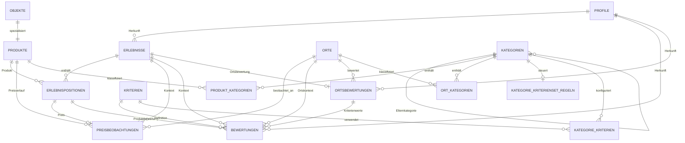
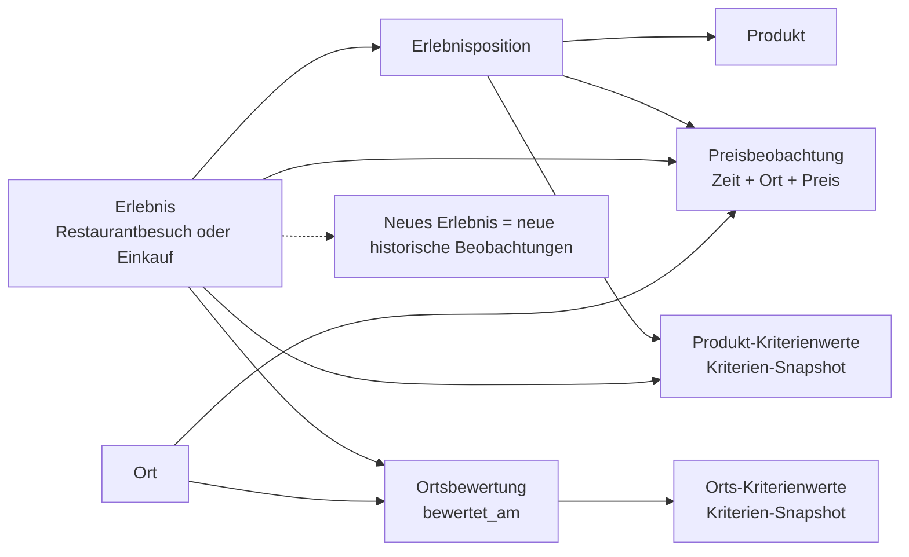

# Datenbank, Schema und Migrationen

## Ziel und Geltungsbereich

Taugt’s? speichert seine fachlichen Daten offline-first in einer lokalen SQLite-Datei `taugts.sqlite` im Application-Support-Verzeichnis der jeweiligen Plattform. Die Datenbank ist Arbeitsdatenbank; das versionierte JSON-Format ist das davon unabhängige Austausch- und Sicherungsformat.

Diese Seite beschreibt den aktuellen physischen Schema-Stand, seine Beziehungen, die Baseline vor dem ersten produktiven Release und die Regeln für künftige Vorwärtsmigrationen. Maßgeblich für den Migrationsablauf ist `LokaleDatenbank`; die Definition der gemeinsam genutzten Feature-Tabellen liegt in `AktuellesDatenbankschema`.

## Initialisierung und Schemastand

`LokaleDatenbank.oeffnen()` aktiviert `PRAGMA foreign_keys = ON`, liest `PRAGMA user_version` und führt notwendige Vorwärtsmigrationen innerhalb einer `BEGIN IMMEDIATE`-Transaktion aus.

Vor dem ersten produktiven Release wurde die während der Entwicklung entstandene Migrationskette konsolidiert. **Schema 1 bleibt die dauerhafte produktive Baseline. Der aktuelle physische Datenbankstand auf `master` ist **Schema 4**.**

- Eine neue Datenbank besitzt zunächst `user_version = 0`.
- Der initiale Migrationsschritt **0 → 1** erzeugt die produktive Baseline einschließlich der Feature-Tabellen für Kategorien, Klassifikation, Kriteriensets und Import-Unterstützung.
- Der anschließende Schritt **1 → 2** erweitert Bewertungswerte um das optionale Textfeld `text_wert`. Das bisher zwingende numerische Feld `wert` wird optional; eine Datenbankprüfung erzwingt, dass pro Bewertung genau ein numerischer oder textueller Wert gesetzt ist.
- Bereits vorhandene numerische Bewertungen werden bei **1 → 2** unverändert in die neue Tabelle übernommen; `text_wert` bleibt für sie `NULL`.
- **2 → 3** ergänzt für `produkte` und `orte` die Löschmarkierung `geloescht INTEGER NOT NULL DEFAULT 0` (bei bereits vorhandener Spalte idempotent), damit das Entfernen aktiver Stammdaten die historische Zuordnung nicht vernichtet.
- **3 → 4** baut die Erlebnistabelle neu auf und führt `beginn` und `ende` als gemeinsamen Zeitraum ein. Ein tatsächlicher Beginn hat Vorrang, sonst wird der geplante Zeitpunkt und ersatzweise `erlebt_am` übernommen. Ein tatsächliches Ende wird nur mit vorhandenem tatsächlichem Beginn übernommen. Getrennte Plan-/Ist-Felder und Status entfallen.
- Anschließend werden die Standardkriterien idempotent bereitgestellt und `user_version` auf **4** gesetzt. Erst nach erfolgreicher Migration und Fremdschlüsselprüfung gilt die Datenbank als Schema 4.

Die früheren Entwicklungsstände 1 bis 13 vor der Baseline-Konsolidierung sind keine unterstützten Produktivschemata mehr. Für sie existiert bewusst kein Upgradepfad. Die nach der Konsolidierung definierte produktive **Schemaversion 1** ist davon zu unterscheiden und besitzt mit **1 → 2** nun den ersten dauerhaft zu erhaltenden Vorwärtsmigrationspfad.

## Baseline und künftige Migrationen

Die Konsolidierung entfernt nur historische Entwicklungsaltlasten; der Migrationsmechanismus selbst bleibt verbindlich erhalten. Ab dem produktiven Schema 1 gilt:

1. Jede persistenzrelevante Schemaänderung erhöht `schemaVersion` genau um einen Schritt.
2. Der erste produktive Folgeschritt ist **1 → 2** für typisierte Bewertungswerte. Die Folgeschritte **2 → 3** (Löschmarkierung) und **3 → 4** (Erlebniszeitraum) sind implementiert; die nächste Änderung erfolgt als **4 → 5**.
3. Eine Migration wird transaktional ausgeführt und erst nach erfolgreichem Abschluss durch die neue `user_version` bestätigt.
4. Für einmal produktiv ausgelieferte Schemaversionen bleibt der Upgradepfad erhalten. Produktive Nutzerdaten dürfen nicht still verworfen werden.
5. Eine Datenbank mit einer höheren, von der installierten App nicht unterstützten Schemaversion wird verständlich abgelehnt.
6. Jede neue Migration erhält Tests für den unmittelbar vorherigen unterstützten Produktivstand sowie die Neuanlage auf dem aktuellen Schema.

Damit ist Schema 1 der dauerhafte Ausgangspunkt der produktiven Migrationshistorie und Schema 4 der aktuelle Stand. Die vor der Baseline liegenden Entwicklungszwischenstände werden nicht mehr im Anwendungscode nachgebildet.

Einige Legacy-Spalten aus dem frühen Vor-Positionsmodell (`produkt_id`, `kaufort_id`, `konsumort_id`, `preis`, `menge`, `gebinde`) existieren auch in Schema 4 weiterhin. Die zeitlichen Legacy-Felder sowie `status` wurden dagegen mit 3 → 4 entfernt; siehe „Fachlicher Schema-Abgleich“.

## Tabellen und Verantwortlichkeiten

### Stammdaten und Identität

- `profile`: lokale Herkunftsidentität für selbst erfasste und importierte Beobachtungen.
- `objekte`: gemeinsame Basis der derzeit als Produkt geführten bewertbaren Objekte mit Name, Art und Zeitstempeln.
- `produkte`: produktbezogene Stammdaten; Primärschlüssel ist zugleich Fremdschlüssel auf `objekte`. `geloescht` markiert nicht mehr aktiv auswählbare Produkte, ohne historische Referenzen zu entfernen.
- `orte`: wiederverwendbare Gastronomie-, Geschäfts-, private und sonstige Orte mit optionaler Adresse und Geodaten. `geloescht` blendet entfernte Stammdaten aus, ohne historische Beziehungen zu löschen.

### Erlebnis und Historie

- `erlebnisse`: zeitlicher Kontext für Restaurantbesuch oder Einkauf mit einem optionalen `beginn` und `ende`, Ort, Notiz und Herkunftsprofil. Ein gesonderter persistierter Status existiert nicht mehr.
- `erlebnispositionen`: Produkte innerhalb eines Erlebnisses; Anzahl ist mindestens 1.
- `preisbeobachtungen`: beobachteter Einzelpreis einer konkreten Position mit Minor-Einheiten, Währung, Zeitpunkt und optionalem Ort. Pro Position existiert höchstens eine Preisbeobachtung; eine Korrektur aktualisiert diese Beobachtung, ein neues Erlebnis erzeugt eine neue Position und damit eine neue historische Beobachtung.
- `ortsbewertungen`: eigenständige historische Bewertung des Ortes in genau einem Erlebnis. `erlebnis_id` ist eindeutig, sodass ein Erlebnis höchstens eine Ortsbewertung besitzt.
- `bewertungen`: einzelne Kriterienwerte. Produktwerte verweisen auf die Erlebnisposition; Ortswerte können auf `ortsbewertungen` verweisen. Numerische Eingabetypen verwenden `wert`, Auswahl und Freitext verwenden `text_wert`; genau eines der beiden Felder ist pro Datensatz gesetzt. Zusätzlich werden Kriterienname, -typ, -reihenfolge, -version, -beschreibung und Auswahlwerte als Snapshot gespeichert, damit alte Bewertungen trotz später geänderter Kriterien interpretierbar bleiben.
- `kriterien`: aktuelle konfigurierbare Definitionen der Bewertungsdimensionen.

### Kategorien und Klassifikation

- `kategorien`: hierarchische Kategorie mit Bereich Produkt/Ort und optionaler Elternkategorie.
- `produkt_kategorien`, `ort_kategorien`: n:m-Zuordnungen von Produkten beziehungsweise Orten zu Kategorien.
- `objekt_tags`: normalisierte freie Tags.
- `objekt_klassifikationsmerkmale`: strukturierte Merkmale wie Herkunft, Hersteller und weitere Eigenschaften.
- `kategorie_kriterienset_regeln`: Regel und Version des für eine Kategorie wirksamen Kriteriensets.
- `kategorie_kriterien`: geordnete Zuordnung konkreter Kriterien zu einer Kategorie.

### Import-Unterstützung

- `import_aliases`: persistente Abbildung importierter Alias-IDs auf lokale kanonische IDs für Objekte und Orte.
- `import_protokoll`: datensparsame Historie ausgeführter Importe und ihrer Ergebniszähler.

## ER-Diagramm

```mermaid
erDiagram
    PROFILE ||--o{ ERLEBNISSE : Herkunft
    PROFILE ||--o{ BEWERTUNGEN : Herkunft
    PROFILE ||--o{ ORTSBEWERTUNGEN : Herkunft

    OBJEKTE ||--|| PRODUKTE : spezialisiert
    PRODUKTE ||--o{ ERLEBNISPOSITIONEN : Produkt
    ERLEBNISSE ||--o{ ERLEBNISPOSITIONEN : enthält
    ERLEBNISPOSITIONEN ||--o| PREISBEOBACHTUNGEN : Preis
    ERLEBNISSE ||--o{ PREISBEOBACHTUNGEN : Kontext
    PRODUKTE ||--o{ PREISBEOBACHTUNGEN : Preisverlauf
    ORTE ||--o{ PREISBEOBACHTUNGEN : beobachtet_an

    ERLEBNISSE ||--o{ BEWERTUNGEN : Kontext
    ERLEBNISPOSITIONEN ||--o{ BEWERTUNGEN : Produktbewertung
    KRITERIEN ||--o{ BEWERTUNGEN : Definition
    ORTE ||--o{ BEWERTUNGEN : Ortskontext

    ERLEBNISSE ||--o| ORTSBEWERTUNGEN : Ortsbewertung
    ORTE ||--o{ ORTSBEWERTUNGEN : bewertet
    ORTSBEWERTUNGEN ||--o{ BEWERTUNGEN : Kriterienwerte

    KATEGORIEN ||--o{ KATEGORIEN : Elternkategorie
    PRODUKTE ||--o{ PRODUKT_KATEGORIEN : klassifiziert
    KATEGORIEN ||--o{ PRODUKT_KATEGORIEN : enthält
    ORTE ||--o{ ORT_KATEGORIEN : klassifiziert
    KATEGORIEN ||--o{ ORT_KATEGORIEN : enthält
    KATEGORIEN ||--o| KATEGORIE_KRITERIENSET_REGELN : steuert
    KATEGORIEN ||--o{ KATEGORIE_KRITERIEN : konfiguriert
    KRITERIEN ||--o{ KATEGORIE_KRITERIEN : verwendet
```

Die Klassifikationstabellen `objekt_tags` und `objekt_klassifikationsmerkmale` besitzen derzeit bewusst keinen SQLite-Fremdschlüssel, weil ihre generische `objekt_id` fachlich unterschiedliche Zielarten adressieren kann. Das ist zugleich ein dokumentiertes Integritätsdelta.

Das Entfernen von Produkten oder Orten setzt in Schema 3 und höher eine Löschmarkierung, anstatt historische Beobachtungen kaskadierend zu löschen. Das folgende ER-Diagramm zeigt die logischen Beziehungen; optionale beziehungsweise nach dem Löschen nicht mehr aktiv auflösbare Zuordnungen werden in der Anwendung als **Nicht zugeordnet** kenntlich gemacht.

## Historisches Beobachtungsmodell

```mermaid
flowchart LR
    E[Erlebnis\nRestaurantbesuch oder Einkauf]
    O[Ort]
    P[Erlebnisposition]
    PR[Produkt]
    PB[Preisbeobachtung\nZeit + Ort + Preis]
    BW[Produkt-Kriterienwerte\nKriterien-Snapshot]
    OB[Ortsbewertung\nbewertet_am]
    OW[Orts-Kriterienwerte\nKriterien-Snapshot]

    E --> P
    P --> PR
    P --> PB
    E --> PB
    O --> PB
    P --> BW
    E --> BW
    E --> OB
    O --> OB
    OB --> OW

    N1[Neues Erlebnis = neue historische Beobachtungen]
    E -.-> N1
```

Damit ist der aktuelle Preis **kein Feld am Produktstamm** und die aktuelle Bewertung **kein Feld am Produkt oder Ort**. Verlauf entsteht durch mehrere Erlebnisse und deren eigenständige Beobachtungen.

## Integritätsregeln

SQLite erzwingt bereits unter anderem:

- Primärschlüssel für alle zentralen fachlichen Datensätze.
- Kaskadierendes Löschen von Produktdetails beim Basisobjekt sowie von Positionen/Beobachtungen beim zugehörigen Erlebnis, wo fachlich vorgesehen.
- `anzahl >= 1` für Erlebnispositionen.
- `betrag_minor >= 0` für Preise; Geld wird ohne binäre Rundungsfehler in Minor-Einheiten gespeichert.
- Für den gemeinsamen Erlebniszeitraum wird die Chronologie (Ende nicht vor Beginn) fachlich validiert; die früheren Spalten für geplante Minute und geplante Dauer sind seit Schema 4 nicht mehr vorhanden.
- Höchstens eine Preisbeobachtung pro Erlebnisposition.
- Höchstens eine Ortsbewertung pro Erlebnis.
- Für jeden Kriterienwert ist genau eines der Felder `wert` oder `text_wert` gesetzt; leere Textwerte sind unzulässig.
- Eindeutige Kategoriezuordnungen und eindeutige normalisierte Tags pro Zielobjekt.
- Import-Alias darf nicht auf sich selbst zeigen und ist auf die Sammlungen `objekte`/`orte` begrenzt.

Zusätzliche fachliche Regeln wie die konkrete Zuordnung von Eingabetyp zu numerischem beziehungsweise textuellem Wert, Kategoriezyklen und Erlebnis-Zeitkombinationen werden in Fach-/Repositorylogik validiert. SQLite kann diese Regeln nicht in jedem Fall sinnvoll allein ausdrücken.

## Fachlicher Schema-Abgleich

Abgeglichen wurden insbesondere die Stories #2, #4, #5, #8, #15, #17, #23, #70, #71, #72, #73, #74 und #76 sowie Bug #205.

| Anforderung | Stand | Bewertung |
| --- | --- | --- |
| Trennung Stammdaten, Erlebnis, Position, Preis, Produkt- und Ortsbewertung | Erfüllt | Das Historienmodell bildet wiederholte Preise und Bewertungen ohne Überschreiben früherer Erlebnisse ab. |
| Mehrere Produkte pro Restaurantbesuch/Einkauf | Erfüllt | `erlebnispositionen` ist 1:n zum Erlebnis. |
| Preis pro Produkt, Ort und Erlebnis historisch | Erfüllt | `preisbeobachtungen` referenziert Position, Produkt, Erlebnis, Zeitpunkt und optional Ort. |
| Separate historische Gaststätten-/Geschäftsbewertung | Erfüllt | `ortsbewertungen` ist vom Produktpfad getrennt und besitzt `bewertet_am`. |
| Historisch interpretierbare Kriterien | Erfüllt | Kriterien-Snapshots liegen in `bewertungen`; die aktuelle Kriteriendefinition kann sich weiterentwickeln. |
| Typgerechte Kriterienwerte | Erfüllt ab Schema 2 | Numerische Typen liegen in `wert`; `Auswahl` und `Freitext` in `text_wert`. Die 1→2-Migration bewahrt sämtliche bisherigen numerischen Werte. |
| Kategorien und Kriteriensets | Erfüllt, physische Initialisierung konsolidiert | Die Tabellen sind Bestandteil der transaktionalen Schema-1-Baseline und werden nicht erst beim Repositoryzugriff nachgezogen. |
| Expliziter fachlicher Zeitpunkt jeder Produktbewertung | **Teilweise** | `bewertungen` besitzt `erstellt_am`/`geaendert_am`, aber kein ausdrücklich benanntes `bewertet_am`. Der Erlebniszeitpunkt liefert Kontext, die Bedeutung von `erstellt_am` als Beobachtungszeitpunkt ist jedoch nicht so eindeutig wie bei `ortsbewertungen`. |
| Eindeutiger Bewertungskontext auf DB-Ebene | **Teilweise** | SQLite verhindert derzeit nicht, dass ein Kriterienwert gleichzeitig oder gar nicht auf Produktposition/Ortsbewertung verweist. Die Fachlogik muss diese Invariante sichern. |
| Einheitliches Erlebnis ohne Altmodell | **Teilweise** | Mit Schema 4 entfallen `status`, `erlebt_am` und die getrennten Plan-/Ist-Felder. Die älteren Spalten `produkt_id`, `kaufort_id`, `konsumort_id`, `preis`, `menge`, `gebinde` sind weiterhin vorhanden und können fachlich vorhandene Positionsdaten duplizieren. |
| Klassifikationsreferenzen referenziell abgesichert | **Abweichung** | `objekt_tags` und `objekt_klassifikationsmerkmale` haben wegen ihrer generischen Ziel-ID keinen Foreign Key. Verwaiste Klassifikationsdaten sind auf DB-Ebene möglich. |
| Ein einziger Klassifikationswert für Kriterien | **Abweichung/Legacy** | `kriterien` enthält sowohl `produktart` als auch `objektart`. `objektart` ist der neuere allgemeinere Fachwert; beide Werte können prinzipiell auseinanderlaufen. |

### Empfohlene Folgearbeiten

Die drei fachlich relevantesten Folgeschritte sind:

1. Das Legacy-Erlebnismodell aus Fachmodell und Repository entfernen und anschließend die verbliebenen sechs Legacy-Spalten in einer eigenen, getesteten Migration abbauen. Erst dann ist ein verlustfreies Tabellen-Rebuild sinnvoll.
2. Für Produktbewertungen einen expliziten fachlichen Bewertungszeitpunkt definieren (`bewertet_am`) oder verbindlich dokumentieren und testen, dass `erstellt_am` genau diese Semantik besitzt.
3. Eine DB-nahe Integritätsstrategie für Bewertungskontext sowie generische Klassifikationsreferenzen festlegen, ohne die getrennten Produkt-/Ortstabellen künstlich zusammenzuführen.

Diese Punkte werden **nicht** still im Rahmen von Bug #205 umgedeutet, weil sie das Fachmodell und Import-/Exportformat darüber hinaus betreffen und jeweils eigenständige Migrationen benötigen.

## Sicherung, Wiederherstellung und Fehlerverhalten

Migrationen laufen atomar. Schlägt ein Schritt fehl, wird die Transaktion zurückgerollt und der bisherige `user_version`-Stand bleibt erhalten. Eine Datenbank mit einer neueren, von der App nicht unterstützten `user_version` wird nicht geöffnet.

Für die einmalige Baseline-Konsolidierung vor dem ersten produktiven Release gilt: Entwicklungs- und Vorabdatenbanken mit den früheren internen Versionsständen werden nicht migriert. Wer darin Testdaten erhalten möchte, muss sie vor dem Wechsel über das von der physischen SQLite-Struktur entkoppelte JSON-Austauschformat exportieren, die lokale Datenbank neu anlegen lassen und die Daten anschließend über den regulären Importpfad wieder einlesen.

Für alle migrationsrelevanten Änderungen ab der produktiven Baseline gilt:

1. Das bestehende JSON-Gesamtexportformat ist der bevorzugte nutzerinitiierte Sicherungs- und Wiederherstellungsweg, weil es von der physischen SQLite-Struktur entkoppelt ist.
2. Eine rohe Kopie von `taugts.sqlite` darf nur bei geschlossener App beziehungsweise nach sauber geschlossenem Datenbank-Handle als technische Sicherung betrachtet werden. Das Projekt implementiert derzeit keinen automatischen Datei-Snapshot vor jeder Migration.
3. Eine Migration darf erst nach Tests mit Neu-Datenbank und mindestens dem unmittelbar vorherigen unterstützten Produktivstand als abgeschlossen gelten.
4. Destruktive Tabellen-Rebuilds benötigen einen expliziten Nachweis, wie jeder fachlich relevante Altwert in den Zielstand übernommen wird. Für 1 → 2 wird dieser Nachweis durch den Migrationstest erbracht, der vorhandene numerische Bewertungen unverändert übernimmt. Für 3 → 4 sichern Tests die Übernahme der bisherigen Erlebniszeiten und die Integrität der referenzierenden Daten.

## Pflege-Regel für künftige Änderungen

Eine neue persistierte Fachstruktur muss in derselben Story gleichzeitig in vier Perspektiven aktualisiert werden:

1. DDL beziehungsweise Vorwärtsmigration,
2. Neuanlage/Baseline der Datenbank,
3. automatisierte Migrations- und Integritätstests,
4. diese Architektur- und Diagrammdokumentation.

Damit kann das physische Schema nicht erneut unbemerkt von den fachlichen Stories und der Dokumentation auseinanderlaufen.
